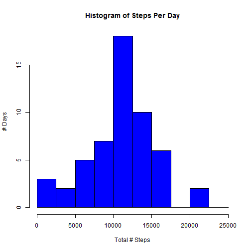
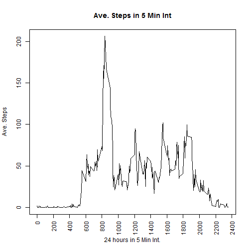
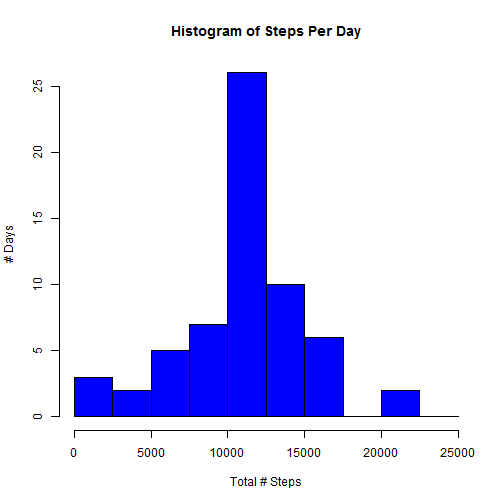
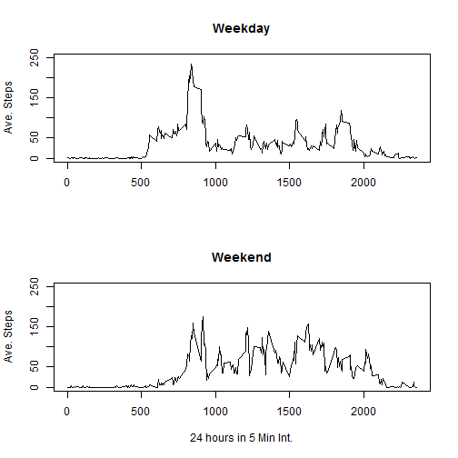

++++++++++++++++++++++++++++++++++++++++++++++++++++++++++++++++++++++++++++++++++++++++

This assignment makes use of data from a personal activity monitoring device. This device collects data at 5 minute intervals through out the day. The data consists of two months of data from an anonymous individual collected during the months of October and November, 2012 and include the number of steps taken in 5 minute intervals each day.

++++++++++++++++++++++++++++++++++++++++++++++++++++++++++++++++++++++++++++++++++++++++


## Loading and preprocessing the data


```r
options(scipen=999)
ActivityData <- read.csv("activity.csv")
```

Process/transform the data:
Converting date and interval into time format


```r
ActivityData$dateTime <- strptime(ActivityData$date, "%Y-%m-%d")

ActivityData$time <- as.numeric(ActivityData$interval)
ActivityData$Minute <- ActivityData$time %% 100
ActivityData$Hour <- (ActivityData$time - ActivityData$Minute) / 100
ActivityData$dateTime2 <- ActivityData$dateTime + ActivityData$Minute * 60 + ActivityData$Hour * 360
```

Converting number of steps from text into integer


```r
ActivityData$step1 <- as.numeric(ActivityData$steps)
```

Make a histogram of the total number of steps taken each day
 

## What is mean total number of steps taken per day?


```r
mean <- mean(ActivityByDate$x, na.rm = TRUE)
median <- median(ActivityByDate$x, na.rm = TRUE)
```
The mean of total number of steps taken per day is 10766.1886792.

The median of total number of steps taken per day is 10765.

## What is the average daily activity pattern?
Time series plot (i.e. type = "l") of the 5-minute interval (x-axis) and the average number of steps taken, averaged across all days (y-axis)

 

Which 5-minute interval, on average across all the days in the dataset, contains the maximum number of steps?

```r
MaxSteps <- ActivityByMin[which.max(ActivityByMin$x),1]
```

The 5-minute interval that contains the maximum number of steps is 835.

## Imputing missing values
Calculate and report the total number of missing values in the dataset (i.e. the total number of rows with NAs)


```r
x <- nrow(ActivityData[ActivityData$steps == 'NA',])
```

Total number of missing values is 2304.


```r
ActivityData2 <- ActivityData

for( i in 1:nrow(ActivityData2) ) {
    
  if (is.na(ActivityData2$steps[i])) {
    int_na <- ActivityData2$interval[i] 

    by_min <- ActivityByMin[ActivityByMin$interval == int_na,]  

    ActivityData2[i,9] <- by_min$x
  }
}
```

Make a histogram of the total number of steps taken each day 
 

Calculate and report the mean and median total number of steps taken per day

```r
mean2 <- mean(ActivityByDate2$x, na.rm = TRUE)
median2 <- median(ActivityByDate2$x, na.rm = TRUE)
```
he mean of total number of steps taken per day is 10766.1886792.

The median of total number of steps taken per day is 10766.1886792.

Do these values differ from the estimates from the first part of the assignment? What is the impact of imputing missing data on the estimates of the total daily number of steps?

Answer:  The mean and median of the dataset with filled in data value do not differ significantly from the mean and median of the original dataset.  This indicates that there is no bias in the missing data.

## Are there differences in activity patterns between weekdays and weekends?
Create a new factor variable in the dataset with two levels -- "weekday" and "weekend" indicating whether a given date is a weekday or weekend day

```r
ActivityData$Weekday <- weekdays(ActivityData$dateTime)
ActivityWeekend <- ActivityData[ActivityData$Weekday == 'Saturday'| ActivityData$Weekday == 'Sunday',]
ActivityWeekday <- ActivityData[ActivityData$Weekday != 'Saturday' & ActivityData$Weekday != 'Sunday',]
ActivityByWkend <-aggregate(ActivityWeekend$step1, by=list(interval=ActivityWeekend$interval), FUN=mean, na.rm=TRUE)
ActivityByWkday <-aggregate(ActivityWeekday$step1, by=list(interval=ActivityWeekday$interval), FUN=mean, na.rm=TRUE)
```


Make a panel plot containing a time series plot (i.e. type = "l") of the 5-minute interval (x-axis) and the average number of steps taken, averaged across all weekday days or weekend days (y-axis).

 


